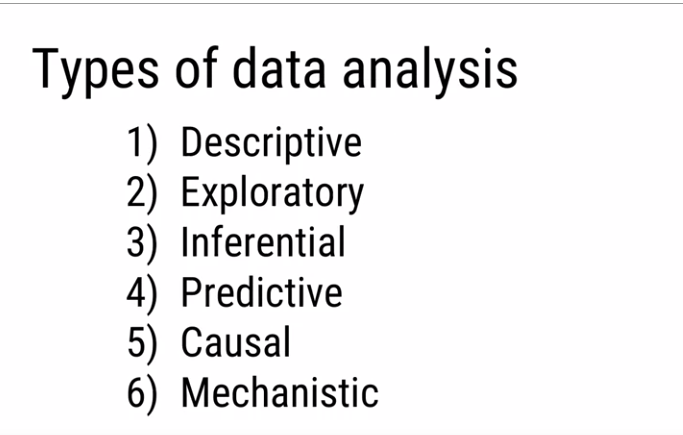

## Descriptive Analysis

**Goal:** Describe or summarize a set of data

* Early analysis when receive new data
* Generate simple summaries about samples and their measurements.(Mean, Variance, Mode, Median)
* Not for generalizing the results of the analysis to a larger population or trying to make conclusions

Commonly, the first type of analysis made.

## Exploratory analysis

**Goal:** Examine the data and find relationships that weren't previously known

* Explore how different variables might be related 
* Useful for discovering new connections
* Help to formulate hypotheses and drive the design of future studies and data collection

## Inferential Analysis

**Goal:** USe a relatively small sample of data to say something about the population at large

* Provide your estimate of the variable of the population and provide your uncertainty about your estimate

* Ability to accurately infer information about larger population depends heavily on sampling scheme 

## Predictive Analysis

**Goal:** Use current and historical data to make predictions about future data

* Accuracy in predictions is dependent on measuring the right variables
* Many ways to build up predictions models with some being better or worse for specific cases,
  + More data and a simple model generally performs rely at predicting future outcomes
  
## Causal Analysis

**Goal:** See what happens to one variable when we manipulate another variable

* Gold standard in data analysis
* Often applied to the results of randomized studies that were designed to identify causation
* Usually analyzed in aggregate and observed relationships are usually average effects

## Mechanistic Analysis

**Goal:** Understand the exact changes in variables that lead to exact changes in other variables

* Applied to simple situations or those that are nicely modeled by deterministic equations
* Commonly applied to physical or engineering sciences
* Often, the only noise in the data is measurement errors

Very difficult to use, much specific.