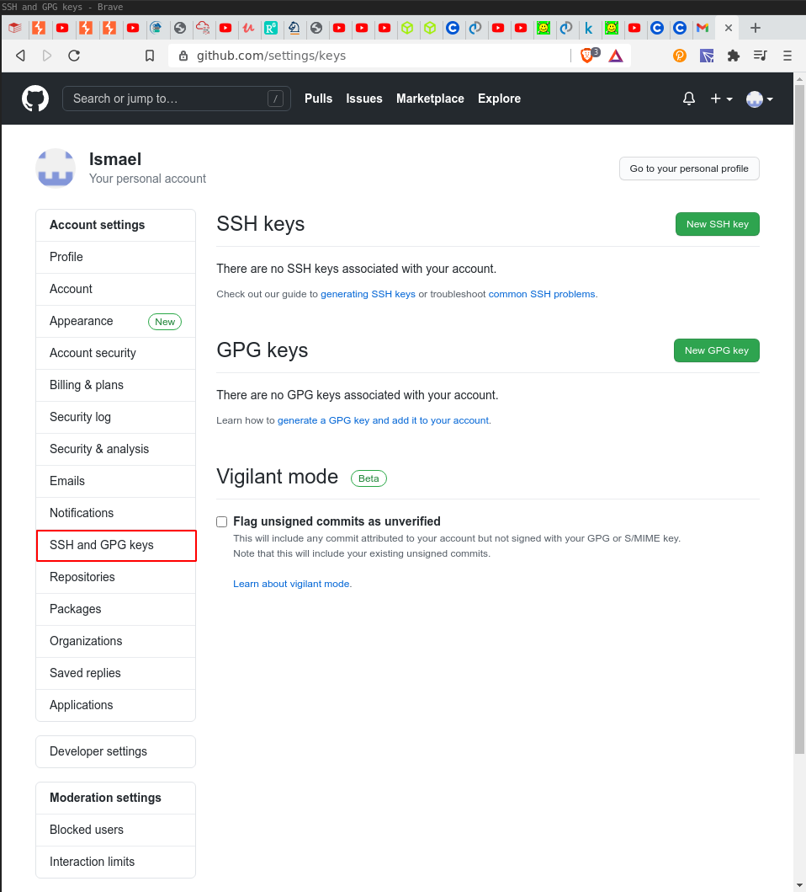
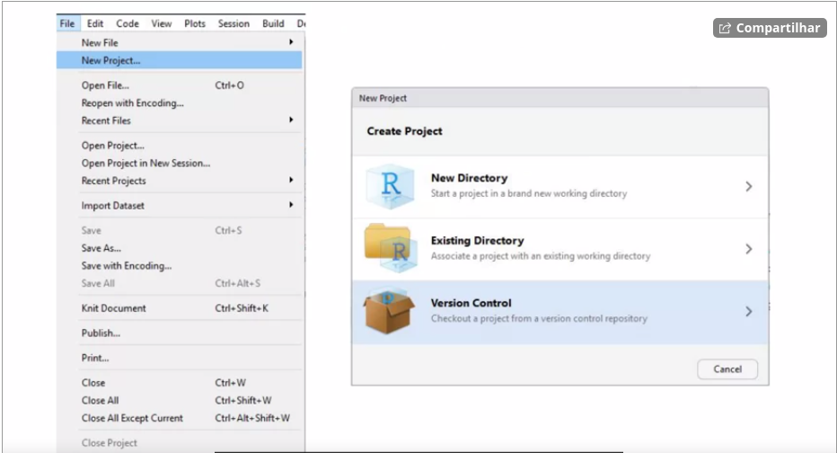

```{r setup, include=FALSE}
knitr::opts_chunk$set(echo = TRUE)
```

## Link github and Git

To link github with RStudio jut go to Tools>Global Options> Git/SVN 

Then, choose a passphrase and generate a RSA Key
Copy the RSA key and go to the github profile settings

 
 
 Click on create SSH Key> Add new 
 
 Paste the RSA code there and click on ADD SSH Key
 
 Github and RStudio are now linked
 
 Create a new repository on github and click in new project on RStudio
 than, select version control> Git
 
  
  

If you have a project that is already started but is not under version control
you can do git manually in terminal (The common way) and then restart session in R

If you want to contribute to someone's else repository, just do the same thing as the image above. But put the link of the person's repository.